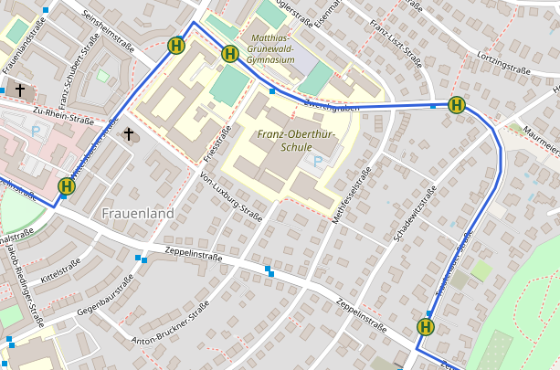

#Route Detour Analyzer

Routes in public transportation often do not use shortest path between their origin
and their final destination. I wondered how much deviation from the shortest path
are the passengers willing to accept.

For example, in the image below, the detour of the bus line is 500 m (or 1.71 times)
longer than the shortest path between the leftmost and the rightmost station.

I wondered: How much detour is acceptable on any bus line between the stations? In
order to evaluate this I wrote the Route Detour Analyzer. It allows defining lines
and compute the detours of sub paths withing that line.

## Features

* Define custom lines and experiment
* Fine-tune lines by using way points (these are not counted as stops)  
* Parameterizable analysis
* Min, median, average, and maximal detour per line   
* Automatic name generation for stops based on address data  
* Colorize lines
* Use different routing severs and tile layers

## Prerequisistes

It is mandatory to have access to a OSRM server as well as a tile server. 
