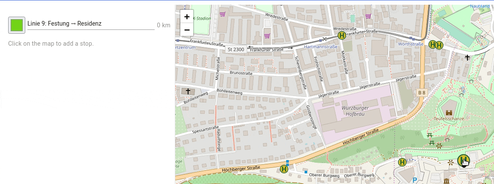

# Public Transport Line Editor

*Public Transport Line Editor* allows creating bus lines. The initial idea of this program
arose from an open topic in my Master's thesis. While examining an algorithm for dial-by-ride
planning, I wondered how much detour passengers accept on public transport routes.

For this, I created PTL Editor which should help to answer the question. I have currently some ideas
for further features.

### Evolution ###

This project is currently on its way to version 2, which will not only be incompatible
with version 1, but will also get a new name which I don't know yet. This 
README describes the current development version 2 (main branch). For a description
of the old version 1, please refer to the release of version 1.1.0.

## Features

* Define unlimited lines with custom color and names:

* Create stations, rename them, drag them to new locations, toggle between real stations or just waypoint-stations 
  (used to fine tune line routes)
  
* Intuitive line editor to connect stations to lines:
  
* Parameterizable analysis
* Min, median, average, and maximal detour per line
  
* Automatic name generation for stops based on address data  
* Use different routing servers and tile layers
* Import and export (whole workspace, single lines)

## Changelog

For a detailed changelog, please use Github's commit based changelog generator.

Version 1.x.x

* Basic features such as creating, editing, and deleting lines
* Import and Export

Version 2.x.x

* Rework of the app's structure: there is now a backend and a frontend.
  **Note on the backend's API**: The backend implements Json-RPC 2.0 to communicate with the
  frontend. This API is not intended for public use and may change at any point without prior notice.
* BREAKING CHANGE: the scenario file format has been changed drastically. There is no automatic
  migration. Please write a migration yourself if you need to.
* BREAKING CHANGE: application settings (tile server, OSRM, cap) was removed from the query params.
  OSRM is now entirely handled in the backend, the tile server and the cap are stored in the local
  storage.

## Building the app

### Backend

To build the backend, you need Go 1.16 or higher. Go to the `backend` directory and
execute `go run cmd/persistance/persistence.go --scenario ./scenarios/wuerzburg.json`. This
will serve the backend with a default scenario.

### Frontend

In the `frontend` directory, issue `npm i && ng serve`.

## Usage

In order to use the app, a tile server URL is needed for displaying the map, and a OSRM server URL
is needed for the actual routing. Some public tile servers can be found at [the OSM wiki](https://wiki.openstreetmap.org/wiki/Tile_servers),
and the [OSRM Demo Server](https://github.com/Project-OSRM/osrm-backend/wiki/Demo-server) is available
for quick testing. Please be aware that there are usage policies restricting the offered demo services
of OSM and OSRM. For heavy usage of the app, I suggest self-hosting [tile servers](https://switch2osm.org/serving-tiles/using-a-docker-container/) and [OSRM servers](https://hub.docker.com/r/osrm/osrm-backend/).

Enter both URLs into the Settings section of the landing page of the app. Then, you can start to enter and edit lines.
The detour analysis is only
available for the currently selected line. It works with a *Evaluation Range Cap*. This cap 
essentially limits the lengths of sub tours that are considered. A cap of 0 means that only
the complete tour is analyzed, i.e. the total length of the line is compared to the shortest path
between source and origin.

If the cap is 1, then all sub tours with at most one stop less than the whole line are considered. This makes
for two additional sub paths, making three in total. No matter how high the cap is, the minimal
sub tours that are considered consist of two stops.

The initial cap can also be controlled with the query parameter `cap`.

The initial location of the map can be set with the query parameter `map=ZOOM/LATITUDE/LONGITUDE`. Thus by
using all query params in a bookmark, all settings can easily be persisted.

## Sample Network

The app per default displays a sample network containing all city lines of Wuerzburg City in spring 2021.
There are 21 distinct lines. Lines that have significantly different from-path compared to the to-path
are contained twice, which makes 37 sample lines in the file. For every line only the main path
is realized. Please do not use these lines for actual route planing as they might be imprecise and deprecated.
Use the official [public transportation site](https://vvm-info.de) for that.

Please be aware that the sample also contains the whole the detailed routes of the lines. Depending on your used
OSRM server and profile, the lines will be re-routed once you begin to edit them.

## FAQ

***How can I enable service roads (often used by buses)?***

The routing depends on the OSRM configuration. The OSRM demo is optimized for car routing, which
avoids service roads. If you want other profiles (e.g to allow service roads), you either
have to self-host an OSRM server or pay for one.

***The PTL Editor proposes crazy routes that are not suitable for buses. How to fix that?***

See last question. In some cases, using way points on a line can improve the overall route,
but I overall suggest self-hosting an OSRM server.

***Why does the analyzer sometimes give negative detours?***

PTL Editor only analyzes the lengths of tours. The routing algorithms of OSRM however, often take additional
metrics into account, such es few traffic lights, few crossings and so on. Thus, it might happen
that a bus tour is actually shorter than the path suggested by OSRM. To avoid this, use customize
profiles for the OSRM (only applies to self-hosted OSRM).

## Answer to the initial question

First, I didn't really have time to evaluate the findings, maybe I'll present the actual data on
my sample set of Wuerzburg in the future. It isn't just done by looking at all lines and taking the
average or median of relative detours. The reason lies in the following three points:

**First,** there are some lines that are definitely not designed to be used from source to origin.
The most extreme example is line 13 in Wuerzburg. In practice, nobody enters at the source (left side)
and travels to the final destination (right side) because there is a much faster tram connection with
only a handful of intermediate stops. The line in fact serves to get people *out* of the city in
the first half of stops, and *into* the city in the second half of stops. Solving the problem
is easy if one has local knowledge of the situation. In this case the line can be either split
in two for the sake of analysis or ignored as outlier.

**Second,** the choice of which path to use is multi-dimensional. The bus route might be shorter because the bus is allowed
to go through pedestrian areas while the cars are routed around the old city district. Which one is
better? The first might be shorter but also slower than the latter. The OSRM can incorporate
such metrics in its shortest path, but it cannot easily solve the question which detour is
acceptable in public transport.

**Third,** sub tours of length 2 are trivial because even
in public transport they follow the same path as the OSRM would suggest for cars. On the other hand,
the complete tour is often vastly different from the "best" path between source and destination. Thus,
which sub tours do you consider for a holistic analysis?

I didn't yet have time and nerve to come to terms with these points. Thus, I leave them for discussion
as of now. Maybe I come back to them in the future.

## Shoutouts

Thanks to all the great open-source libraries and tools. I will not name all of them here
because I will forget someone :) .

## License

See [License File](LICENSE).

